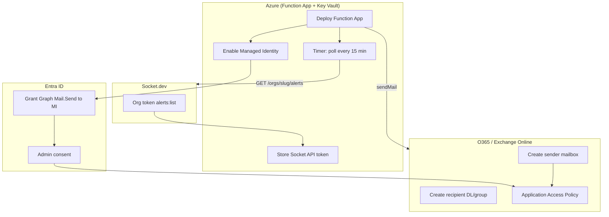

# Configuration Guide

**Status:** Draft for review  
**Version:** 0.2  
**Date:** 2026-05-25  
**Related:** [SPEC.md](./SPEC.md) · [DECISIONS.md](./DECISIONS.md)

External configuration for Socket.dev REST API polling, Microsoft Entra ID, Microsoft Graph, Microsoft 365 / Exchange Online, and Azure platform resources.

---

## Configuration overview



---

## Recommended setup order

| Step | Service | Action |
|------|---------|--------|
| 1 | **O365 / Exchange** | Create sender mailbox and recipient distribution list |
| 2 | **Azure** | Deploy Function App, Key Vault, enable Managed Identity |
| 3 | **Entra ID** | Grant `Mail.Send` to MI + admin consent |
| 4 | **Exchange** | Configure Application Access Policy on sender mailbox |
| 5 | **Socket.dev** | Create org token with `alerts:list`; store in Key Vault |
| 6 | **This repo** | Deploy Function App code |
| 7 | **Validate** | Confirm first poll bootstraps; second poll sends on new alerts |

---

## 1. Socket.dev (C3 AI org tenant)

**Owner:** Socket.dev org owner or admin  
**Prerequisite:** Org token with API access (Enterprise plan confirmed per D12)

### Integration model

This project uses **outbound polling**, not webhooks. The Function calls Socket’s REST API on a timer; Socket does not POST to Azure.

| Item | Value |
|------|-------|
| **API** | `GET https://api.socket.dev/v0/orgs/{org_slug}/alerts` |
| **Auth** | `Authorization: Bearer {org_token}` |
| **Scope** | `alerts:list` |
| **Schedule** | Every 15 minutes (timer trigger) |

Reference: [Socket alerts list API](https://docs.socket.dev/reference/alertslist)

### Org token

Create an organization token in the Socket dashboard with at least **`alerts:list`** scope.

| Setting | Where stored |
|---------|----------------|
| Token value | Azure Key Vault secret `socket-api-token` |
| Org slug | App setting `SOCKET_ORG_SLUG` (Terraform variable `socket_org_slug`) |

### What is **not** configured on Socket.dev

- No webhook URL registration
- No `whsec_` signing key
- No inbound connectivity to Azure required

### First poll behavior

On first run the Function records a poll watermark only (no emails for historical alerts). New or updated alerts after that point trigger email.

---

## 2. Microsoft Entra ID

**Owner:** Entra ID global admin or privileged role admin

### Option A — Managed Identity (recommended)

| Step | Action |
|------|--------|
| 1 | Deploy Function App with **system-assigned managed identity** |
| 2 | Enterprise applications → Function App MI → **API permissions** → Graph **Application** → `Mail.Send` |
| 3 | **Grant admin consent** |

### Option B — App registration + client secret

Use when tenant policy blocks MI Graph application permissions. Store `GRAPH_CLIENT_ID` and `GRAPH_CLIENT_SECRET` in Key Vault and adjust `graphMailSender.ts` if needed (v1 uses MI only).

---

## 3. Microsoft Graph

**Owner:** Entra ID admin (permissions) · DevSecOps (validation)

| API | Permission | Type |
|-----|------------|------|
| `POST /users/{sender}/sendMail` | `Mail.Send` | Application |

Test scope: `https://graph.microsoft.com/.default`

---

## 4. Microsoft 365 / Exchange Online

| Role | Address |
|------|---------|
| **Sender** | `socket-alerts@c3.ai` |
| **Recipients** | `dependency-security@c3.ai` |

### Application Access Policy

```powershell
New-ApplicationAccessPolicy `
  -AppId "<managed-identity-client-id>" `
  -PolicyScopeGroupId "socket-alerts@c3.ai" `
  -AccessRight RestrictAccess `
  -Description "Socket alert Function may send only as socket-alerts@c3.ai"
```

---

## 5. Azure platform

| Resource | Purpose |
|----------|---------|
| Function App (FC1) | Timer poller + Graph mail sender |
| Storage account | Functions runtime + `SocketAlertState` table |
| Key Vault | `socket-api-token` |
| Application Insights | Observability |

### Function App settings

| Setting | Source |
|---------|--------|
| `SOCKET_API_TOKEN` | Key Vault reference → `socket-api-token` |
| `SOCKET_ORG_SLUG` | Terraform / app settings |
| `MAIL_SENDER_UPN` | `socket-alerts@c3.ai` |
| `MAIL_TO_ADDRESSES` | `dependency-security@c3.ai` |
| `MIN_SEVERITY` | Optional filter |
| `INCLUDE_CLEARED` | `true` / `false` |
| `REPO_ALLOWLIST` | Optional comma-separated repo slugs |
| `STATE_TABLE_NAME` | `SocketAlertState` (default) |
| `AzureWebJobsStorage` | Storage connection string |

### Terraform

See [`infra/terraform/README.md`](../infra/terraform/README.md).

```bash
cd infra/terraform
terraform apply
terraform output socket_api_configuration
```

---

## 6. Cross-service matrix

| Item | Socket.dev | Entra ID | Graph | O365 | Azure Function |
|------|:----------:|:--------:|:-----:|:----:|:--------------:|
| Org API token | ✓ | | | | ✓ (Key Vault) |
| Org slug | ✓ | | | | ✓ |
| `Mail.Send` | | ✓ | | | |
| Sender mailbox | | | ✓ | ✓ | ✓ |
| Recipient DL | | | ✓ | ✓ | ✓ |
| Application Access Policy | | | | ✓ | |
| Poll state / idempotency | | | | | ✓ |

---

## 7. Troubleshooting

| Symptom | Likely cause | Action |
|---------|--------------|--------|
| No emails | First poll bootstrap only | Wait for second poll after new alert |
| Socket API 401 | Invalid or expired token | Rotate `socket-api-token` in Key Vault |
| Graph 403 | Application Access Policy | Test policy for sender UPN |
| Duplicate emails | State table unavailable | Check Table Storage / `STATE_TABLE_NAME` |
| Filtered alerts | `MIN_SEVERITY` / `REPO_ALLOWLIST` | Adjust app settings |

---

## Document history

| Version | Date | Changes |
|---------|------|---------|
| 0.1 | 2026-05-25 | Initial configuration guide (webhook model) |
| 0.2 | 2026-05-25 | Polling REST API model; removed webhook/gateway configuration |
