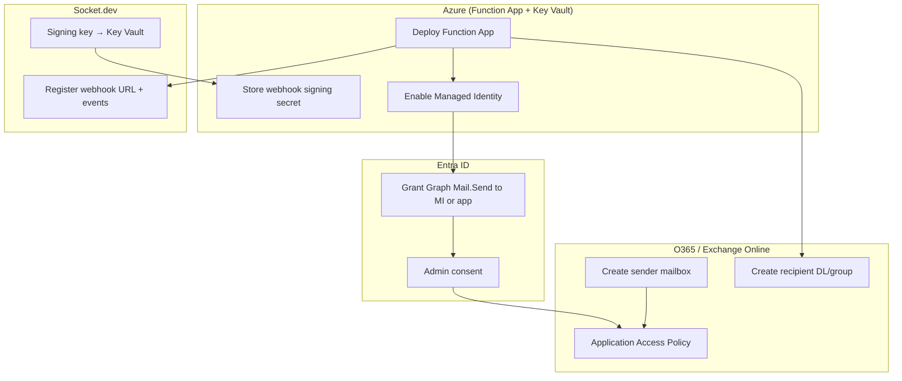

# Configuration Guide

**Status:** Draft for review  
**Version:** 0.1  
**Date:** 2026-05-25  
**Related:** [SPEC.md](./SPEC.md) · [DECISIONS.md](./DECISIONS.md)

This document describes **external configuration** required outside the Azure Function App codebase—for Socket.dev, Microsoft Entra ID, Microsoft Graph, Microsoft 365 / Exchange Online, and Azure platform resources.

Complete the items in [DECISIONS.md](./DECISIONS.md) before finalizing configuration values marked `TBD`.

---

## Configuration overview

The Azure Function App is the runtime glue. Four external services must be configured in addition to deploying the Function App from this repository.



---

## Recommended setup order

| Step | Service | Action |
|------|---------|--------|
| 1 | **O365 / Exchange** | Create sender mailbox and recipient distribution list |
| 2 | **Azure** | Deploy Function App, Key Vault, enable Managed Identity |
| 3 | **Entra ID** | Grant `Mail.Send` to MI (or app registration) + admin consent |
| 4 | **Exchange** | Configure Application Access Policy on sender mailbox |
| 5 | **Graph** | Validate with a manual test send |
| 6 | **This repo** | Implement and deploy Function App code |
| 7 | **Socket.dev** | Register webhook URL and signing key (requires live Function URL) |

---

## 1. Socket.dev (C3 AI org tenant)

**Owner:** Socket.dev org owner or admin  
**Prerequisite:** Business or Enterprise plan (webhooks are not available on lower tiers)

### Where to configure

**Dashboard → Settings → Integrations → Webhooks → Create webhook**

Alternatively, automate via Socket API: `POST /orgs/{org_slug}/webhooks` with an org token scoped `webhooks:create`. See [Socket create webhook API](https://docs.socket.dev/reference/createorgwebhook).

### Required settings

| Setting | Value | Notes |
|---------|-------|-------|
| **Name** | e.g. `c3ai-o365-alerts-prod` | Distinguish dev/staging/prod webhooks |
| **URL** | `https://<function-host>/api/socket-webhook?code=<function-key>` | Configure **after** Function App is deployed |
| **Signing key** | `whsec_...` generated in Socket UI | Store identical value in Azure Key Vault as `socket-webhook-secret` |
| **Event types** | See table below | Select at least one |
| **Repository filters** | Optional | Limit to specific repo IDs if not org-wide |
| **Custom headers** | Optional | e.g. `X-C3-Environment: prod` |

### Event types

| Event type | Description | v1 email behavior |
|------------|-------------|-------------------|
| `alert:created` | New security/dependency alert | Send alert listing email |
| `alert:updated` | Severity or status change | Send update email |
| `alert:cleared` | Alert resolved | Send informational email |
| `pull-request:scan` | PR scan completed (optional) | Send summary of new PR alerts |

### Authentication model

- Socket sends **POST** requests with `Content-Type: application/json`.
- Authentication is **HMAC signature** in the `x-webhook-signature` header—not a Bearer token.
- Format: `t=<unix_timestamp>,s=<base64_hmac>`
- The Function App must verify the signature before processing (see [SPEC.md §5.4](./SPEC.md#54-signature-verification-algorithm)).

### Response expectations

| Response | When |
|----------|------|
| `200 OK` or `204 No Content` | Valid payload processed (or duplicate skipped) |
| `400` / `401` | Invalid signature |
| Non-2xx | Socket will retry delivery |

### What is **not** configured on Socket.dev

- No Entra ID, Graph, or O365 settings
- No inbound API polling required (webhooks push events)

---

## 2. Microsoft Entra ID

**Owner:** Entra ID global admin or privileged role admin

Graph API access is granted through Entra ID. There is no separate "Graph service registration"—permissions are assigned to the Function App Managed Identity or an app registration.

### Option A — Managed Identity (recommended)

| Step | Action |
|------|--------|
| 1 | Deploy Function App with **system-assigned managed identity** enabled |
| 2 | Entra ID → **Enterprise applications** → locate the Function App MI (same name as the Function App) |
| 3 | **API permissions** → Add **Microsoft Graph → Application → `Mail.Send`** |
| 4 | **Grant admin consent** for the C3 AI tenant |

No client secret is required. The Function acquires tokens via `ManagedIdentityCredential` / `DefaultAzureCredential` with scope `https://graph.microsoft.com/.default`.

### Option B — App registration + client secret

Use when tenant policy blocks granting Graph application permissions directly to a Managed Identity.

| Setting | Value |
|---------|-------|
| **Display name** | e.g. `app-socket-alert-mailer` |
| **Supported account types** | Single tenant (C3 AI only) |
| **Redirect URI** | None (daemon / unattended application) |
| **API permissions** | Microsoft Graph → **Application** → `Mail.Send` |
| **Admin consent** | Required |
| **Credentials** | Client secret → Azure Key Vault (`GRAPH_CLIENT_SECRET`) |

Function App settings when using Option B:

| Setting | Source |
|---------|--------|
| `AZURE_TENANT_ID` | C3 AI tenant GUID |
| `GRAPH_CLIENT_ID` | App registration client ID |
| `GRAPH_CLIENT_SECRET` | Key Vault reference |

### Option C — App registration + federated credential (Workload Identity)

No long-lived secret. The Function App MI federates to the app registration. More Entra configuration; use when policy requires an app registration object but forbids client secrets.

### Permission type

| Use | Do | Do not |
|-----|-----|--------|
| Unattended Function App | **Application** permission `Mail.Send` | Delegated permissions (require signed-in user) |

### Optional permissions (not required for v1)

| Permission | Purpose |
|------------|---------|
| `User.Read.All` | Resolve PR author display names in email body |

---

## 3. Microsoft Graph API

**Owner:** Same as Entra ID (permissions) + Function App developers (API usage)

Graph requires minimal standalone configuration. Once Entra permissions and admin consent are in place, the Function App calls Graph directly.

### Endpoint

```http
POST https://graph.microsoft.com/v1.0/users/{senderUpn}/sendMail
Content-Type: application/json
Authorization: Bearer {access_token}
```

### Token acquisition

```http
POST https://login.microsoftonline.com/{tenantId}/oauth2/v2.0/token
Content-Type: application/x-www-form-urlencoded

client_id={clientId}
&scope=https://graph.microsoft.com/.default
&client_secret={secret}        # Option B only; omit for MI
&grant_type=client_credentials
```

For Managed Identity, use the Azure Identity SDK instead of manual token POST.

### Message payload (Function App constructs this)

```json
{
  "message": {
    "subject": "[Socket Critical] CVE-2024-XXXX in repo/my-service (npm:lodash)",
    "body": {
      "contentType": "HTML",
      "content": "<html>...</html>"
    },
    "toRecipients": [
      { "emailAddress": { "address": "security-alerts@c3.ai" } }
    ],
    "importance": "high"
  },
  "saveToSentItems": true
}
```

| Field | Configuration source |
|-------|---------------------|
| `{senderUpn}` | App setting `MAIL_SENDER_UPN` |
| `toRecipients` | App setting `MAIL_TO_ADDRESSES` (comma-separated) |
| `replyTo` | Optional app setting |
| `importance` | Derived from Socket alert severity (see [SPEC.md §7.3](./SPEC.md#73-severity--graph-importance-mapping)) |

### Pre-go-live validation

Send one test message using [Graph Explorer](https://developer.microsoft.com/graph/graph-explorer) or a script with the same credentials the Function App will use.

| HTTP status | Likely cause |
|-------------|--------------|
| **401** | Missing admin consent, expired secret, or wrong tenant |
| **403** | Application Access Policy blocking sender mailbox |
| **404** | Sender UPN does not exist |

---

## 4. Microsoft 365 / Exchange Online

**Owner:** Exchange / M365 administrator

### Mailboxes and groups

| Role | Example | Configuration |
|------|---------|---------------|
| **Sender** | `socket-alerts@c3.ai` | Shared mailbox or licensed user; Graph sends **as** this UPN |
| **Recipients** | `dependency-security@c3.ai` | M365 group or distribution list |
| **Reply-To** | `security-team@c3.ai` | Optional; set in Graph message payload |

Record final addresses in [DECISIONS.md](./DECISIONS.md).

### Application Access Policy (strongly recommended)

Restricts the Function App identity so it can send **only** from the designated sender mailbox—even though `Mail.Send` is technically org-wide.

**Exchange Online PowerShell:**

```powershell
# Create policy scoped to sender mailbox only
New-ApplicationAccessPolicy `
  -AppId "<managed-identity-or-app-registration-client-id>" `
  -PolicyScopeGroupId "socket-alerts@c3.ai" `
  -AccessRight RestrictAccess `
  -Description "Socket alert Function may send only as socket-alerts@c3.ai"

# Verify access
Test-ApplicationAccessPolicy `
  -Identity "socket-alerts@c3.ai" `
  -AppId "<managed-identity-or-app-registration-client-id>"
```

Replace placeholder values after completing [DECISIONS.md](./DECISIONS.md) D4 and D5.

### Optional Exchange configuration

| Item | When needed |
|------|-------------|
| Transport rules | Security wants message tagging, journaling, or routing |
| DLP policy exceptions | Alert email content triggers false-positive DLP blocks |
| Mail flow connectors | Not required for Graph `sendMail` |

### What is **not** configured in O365

- No Outlook client rules or connectors for inbound mail
- No special inbound routing—the Function injects mail via Graph into Exchange Online

---

## 5. Azure platform (Function App + supporting resources)

**Owner:** Azure platform / DevOps team

These resources are deployed from this repository (`infra/` when implemented) and wired to external configuration above.

### Resources

| Resource | Purpose |
|----------|---------|
| Resource group | e.g. `rg-socket-alert-prod` |
| Function App (FC1) | HTTP webhook handler + Graph mail sender |
| Storage account | Functions runtime requirement |
| Key Vault | Webhook signing secret; optional Graph client secret |
| Application Insights | Observability |
| Table Storage (or Cosmos DB) | Webhook idempotency store |

### Function App settings

| Setting | Example | Source |
|---------|---------|--------|
| `SOCKET_WEBHOOK_SECRET` | Key Vault reference | Must match Socket signing key |
| `AZURE_TENANT_ID` | C3 AI tenant GUID | App settings |
| `MAIL_SENDER_UPN` | `socket-alerts@c3.ai` | App settings |
| `MAIL_TO_ADDRESSES` | `dependency-security@c3.ai` | App settings |
| `SOCKET_ORG_SLUG` | `c3-ai` | App settings (payload validation) |
| `GRAPH_CLIENT_ID` | App registration client ID | App settings (Option B/C only) |
| `GRAPH_CLIENT_SECRET` | Key Vault reference | Option B only |
| `MIN_SEVERITY` | `low` | App settings (optional filter) |
| `INCLUDE_CLEARED` | `true` | App settings (optional filter) |
| `REPO_ALLOWLIST` | Comma-separated slugs | App settings (optional filter) |
| `IDEMPOTENCY_TABLE_NAME` | `SocketWebhookEvents` | App settings |

### Key Vault RBAC

Grant the Function App Managed Identity **Key Vault Secrets User** on the vault. Do not embed secrets in source control.

### HTTP trigger auth

| Layer | Configuration |
|-------|---------------|
| Azure Functions | Auth level `function` — key appended to webhook URL as `?code=<function-key>` |
| Application | HMAC signature verification on every request (primary security gate) |

Do **not** rely on the Function key alone. Always verify `x-webhook-signature`.

### Optional Azure hardening

| Control | When |
|---------|------|
| API Management | Rate limiting, routing — **required** per [WEBHOOK-INTEGRATION-STANDARD.md](./WEBHOOK-INTEGRATION-STANDARD.md) |
| Azure Front Door | WAF, DDoS — **required** per webhook standard |
| VNet integration | Private networking requirements (may require Elastic Premium plan) |

### 5.1 Terraform: D6 gateway stack

**Owner:** Platform Engineering  
**Guide:** [TERRAFORM-D6-GATEWAY.md](./TERRAFORM-D6-GATEWAY.md)  
**Starter code:** [`../infra/terraform/`](../infra/terraform/)

Deploy Front Door, APIM, Function App (FC1), Key Vault, and supporting resources in the **target subscription** using Terraform.

| Step | Action |
|------|--------|
| 1 | Bootstrap remote state in the subscription (or use platform state storage) |
| 2 | Copy `infra/terraform/terraform.tfvars.example` → `terraform.tfvars` |
| 3 | Set `subscription_id`, `custom_domain` / webhook path (D6), mail settings (D4/D9) |
| 4 | `terraform init` → `plan` → `apply` |
| 5 | `terraform output socket_webhook_url` → register in Socket.dev |
| 6 | Store signing secret in output Key Vault; complete Entra / Exchange steps |

**Socket.dev registers:** `terraform output socket_webhook_url` only — never the Function `*.azurewebsites.net` hostname.

Implement module stubs in `infra/terraform/modules/{gateway,apim,function}/` per the guide. Modules are scaffolded; resource blocks are marked `TODO` for platform engineering to complete against subscription policy.

---

## 6. Cross-service configuration matrix

| Configuration item | Socket.dev | Entra ID | Graph | O365 / Exchange | Azure Function |
|--------------------|:----------:|:--------:|:-----:|:---------------:|:--------------:|
| Webhook URL | ✓ | | | | ✓ (hosts endpoint) |
| Signing key (`whsec_`) | ✓ | | | | ✓ (Key Vault) |
| Event type subscription | ✓ | | | | ✓ (handler logic) |
| `Mail.Send` permission | | ✓ | | | |
| Admin consent | | ✓ | | | |
| Sender mailbox | | | ✓ (UPN in API call) | ✓ (create mailbox) | ✓ (`MAIL_SENDER_UPN`) |
| Recipient DL/group | | | ✓ (in API call) | ✓ (create group) | ✓ (`MAIL_TO_ADDRESSES`) |
| Application Access Policy | | | | ✓ | |
| Managed Identity | | ✓ | | | ✓ |
| Idempotency store | | | | | ✓ |

---

## 7. Troubleshooting

| Symptom | Service | Likely cause | Action |
|---------|---------|--------------|--------|
| No webhook received | Socket.dev | URL wrong, Function not deployed | Verify URL and Function key in Socket dashboard |
| `400` invalid signature | Function / Socket | Secret mismatch or body re-serialized before verify | Sync Key Vault secret with Socket; verify raw body handling |
| Graph **401** | Entra ID | No admin consent or expired secret | Re-consent `Mail.Send`; rotate secret |
| Graph **403** | Exchange | Application Access Policy blocks sender | Update or test policy (see §4) |
| Graph **404** | O365 | Sender UPN does not exist | Create mailbox; verify `MAIL_SENDER_UPN` |
| `200 OK` but no email | Function | Filtered by `MIN_SEVERITY` or `REPO_ALLOWLIST` | Adjust app settings |
| Duplicate emails | Azure | Idempotency store unavailable | Restore Table Storage; check TTL |

---

## Document history

| Version | Date | Changes |
|---------|------|---------|
| 0.1 | 2026-05-25 | Initial configuration guide |
