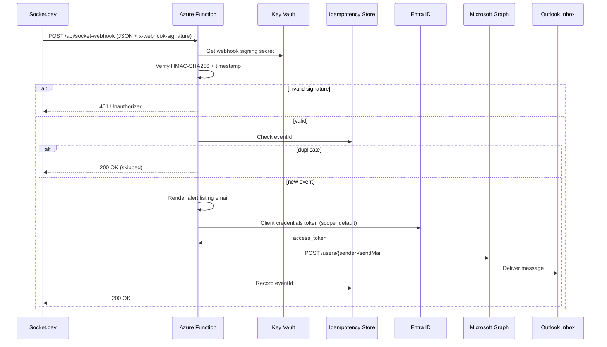

# Socket.dev → Microsoft 365 Alert Email Integration

**Status:** Draft for review  
**Version:** 0.2  
**Date:** 2026-05-25  
**Repository:** `azure-socket-alert`  
**Audience:** C3 AI Platform Engineering, DevSecOps, Entra ID / Exchange admins, Socket.dev org owners

### Related documents

| Document | Purpose |
|----------|---------|
| [WEBHOOK-INTEGRATION-STANDARD.md](./WEBHOOK-INTEGRATION-STANDARD.md) | **C3 AI standard** — secure inbound SaaS webhook pattern (read first) |
| [CONFIGURATION.md](./CONFIGURATION.md) | External service setup — Socket.dev, Entra ID, Graph, O365, Azure |
| [TERRAFORM-D6-GATEWAY.md](./TERRAFORM-D6-GATEWAY.md) | Terraform for D6 gateway stack in target subscription |
| [DECISIONS.md](./DECISIONS.md) | Project-specific decisions and sign-off |

### Review checklist

| Reviewer role | Sign-off items |
|---------------|----------------|
| **Socket.dev org admin** | Webhook event types, repo filters, signing key custody, Business/Enterprise plan confirmed |
| **Entra ID admin** | App registration or MI Graph permissions, admin consent, tenant ID |
| **Exchange / M365 admin** | Sender mailbox, recipient DL, Application Access Policy |
| **Azure platform** | Subscription, resource naming, networking (public vs APIM), Key Vault RBAC |
| **Security** | Threat model (forged webhooks, secret rotation), logging redaction |
| **DevSecOps / on-call** | Alert routing, `MIN_SEVERITY`, runbook ownership |

---

## 1. Executive summary

C3 AI subscribes to [Socket.dev](https://socket.dev) as an organization tenant and wants real-time dependency/security alerts delivered to employee Outlook inboxes hosted on Microsoft 365. Socket.dev supports outbound **webhooks** (Business/Enterprise plans) that POST signed JSON events when alerts are created, updated, or cleared, and when pull request scans complete.

This specification defines an Azure-native integration that:

1. Exposes a secure HTTPS endpoint to receive Socket.dev webhook POSTs.
2. Verifies webhook authenticity using Socket’s Standard Webhooks signing scheme.
3. Transforms alert payloads into a readable **alert listing email** (HTML + plain text).
4. Sends email via **Microsoft Graph API** (`sendMail`) authenticated through **Microsoft Entra ID** (application permission, no interactive user sign-in).

The proposed runtime is an **Azure Function App** (HTTP trigger) backed by **Azure Key Vault** for secrets and **Application Insights** for observability. This aligns with C3 AI’s existing Azure and Entra ID footprint.

---

## 2. Goals and non-goals

### 2.1 Goals

| ID | Goal |
|----|------|
| G1 | Deliver Socket.dev security alerts to C3 AI O365 mailboxes within seconds of webhook receipt |
| G2 | Use Entra ID app-only authentication (client credentials or managed identity) for Graph `Mail.Send` |
| G3 | Verify every inbound webhook with HMAC-SHA256 signature validation before processing |
| G4 | Support alert lifecycle events: `alert:created`, `alert:updated`, `alert:cleared` |
| G5 | Optionally support `pull-request:scan` events with a summary listing of new PR alerts |
| G6 | Operate entirely in Azure with infrastructure-as-code (Bicep or Terraform) |
| G7 | Provide audit logging, dead-letter handling, and idempotency for retried webhooks |

### 2.2 Non-goals (initial release)

| ID | Non-goal |
|----|----------|
| NG1 | Bi-directional Socket API integration (triage, dismiss alerts from email) |
| NG2 | User-delegated Graph permissions (interactive OAuth flows) |
| NG3 | Non-Microsoft email providers |
| NG4 | Long-term alert storage / SIEM replacement (logs only; no dedicated alert database in v1) |
| NG5 | Per-recipient routing based on repo ownership (deferred; v1 uses configured distribution list) |

---

## 3. Context and references

| Source | URL |
|--------|-----|
| Socket webhooks documentation | https://docs.socket.dev/docs/webhooks |
| Socket alerts API (schema reference) | https://docs.socket.dev/reference/alertslist |
| Socket create webhook API | https://docs.socket.dev/reference/createorgwebhook |
| Microsoft Graph `sendMail` | https://learn.microsoft.com/en-us/graph/api/user-sendmail |
| Standard Webhooks specification | https://www.standardwebhooks.com/ |

**Socket plan requirement:** Webhooks are available on Socket **Business** and **Enterprise** plans.

---

## 4. High-level architecture

```mermaid
flowchart LR
  subgraph Socket["Socket.dev (C3 AI org tenant)"]
    WH[Webhook dispatcher]
  end

  subgraph Azure["C3 AI Azure subscription"]
    APIM["Optional: API Management / Front Door"]
    FN["Azure Function App<br/>HTTP trigger"]
    KV["Azure Key Vault"]
    AI["Application Insights"]
    MI["Managed Identity"]
  end

  subgraph Entra["Microsoft Entra ID"]
    APP["App registration<br/>Mail.Send (application)"]
  end

  subgraph M365["Microsoft 365"]
    EXO["Exchange Online"]
    INBOX["Recipient mailbox(es)<br/>Outlook"]
  end

  WH -->|POST + x-webhook-signature| APIM
  APIM --> FN
  WH --> FN
  FN --> KV
  FN --> AI
  FN --> MI
  MI --> APP
  FN -->|POST /users/{sender}/sendMail| EXO
  EXO --> INBOX
```

### 4.1 Component responsibilities

| Component | Responsibility |
|-----------|----------------|
| **Socket.dev webhook** | Push events to C3 AI endpoint; sign payloads with org-configured `whsec_*` key |
| **Azure Function (HTTP)** | Signature verification, parsing, email rendering, Graph API call, HTTP 2xx/4xx responses |
| **Azure Key Vault** | Store webhook signing secret, optional Graph client secret, recipient config overrides |
| **Entra app registration** | Application permission `Mail.Send`; admin consent in C3 AI tenant |
| **Microsoft Graph** | Send mail as configured sender mailbox |
| **Application Insights** | Traces, custom metrics (events processed, emails sent, verification failures) |

### 4.2 Recommended Azure resources

| Resource | SKU / notes |
|----------|-------------|
| Resource group | e.g. `rg-socket-alert-prod` |
| Function App | Linux, .NET 8 isolated **or** Node.js 20 — **Flex Consumption (FC1)** preferred; Elastic Premium (EP) if VNet integration required; avoid legacy Y1 Consumption |
| Storage account | Required by Functions runtime |
| Key Vault | Standard; RBAC authorization |
| Application Insights | Workspace-based |
| (Optional) API Management | Rate limiting, IP allowlisting, custom domain |
| (Optional) Azure Front Door | WAF, TLS termination, DDoS protection |

---

## 5. Socket.dev webhook integration

### 5.1 Webhook registration (Socket dashboard)

C3 AI org owners/admins configure the webhook in **Dashboard → Settings → Integrations → Webhooks → Create webhook**:

| Field | Value |
|-------|-------|
| **Name** | `c3ai-o365-alerts-prod` (example) |
| **URL** | `https://<function-host>/api/socket-webhook?code=<function-key>` (Function key in query string; primary auth is HMAC signature) |
| **Signing key** | Generate in Socket UI; store in Key Vault as `socket-webhook-secret` |
| **Event types** | `alert:created`, `alert:updated`, `alert:cleared`; optionally `pull-request:scan` |
| **Repository filters** | Optional: limit to specific repo IDs |
| **Custom headers** | Optional: e.g. `X-C3-Environment: prod` for routing in multi-env setups |

Webhook creation can also be automated via Socket API (`POST /orgs/{org_slug}/webhooks`) using an org token with `webhooks:create` scope.

### 5.2 Supported event types

| Event type | Use case | Email behavior (v1) |
|------------|----------|---------------------|
| `alert:created` | New security/dependency alert | Send email with alert details |
| `alert:updated` | Alert severity/status change | Send email noting update |
| `alert:cleared` | Alert resolved/cleared | Send informational email (lower priority styling) |
| `pull-request:scan` | PR scan completed | Send summary email listing **new** alerts from scan (optional) |

Alert events (`alert:*`) share schema `alert@1`. PR scan events use `pull-request:scan` with nested `organization`, `repository`, `pullRequest`, and `scan` objects per [Socket webhook docs](https://docs.socket.dev/docs/webhooks).

### 5.3 Inbound HTTP contract

| Property | Value |
|----------|-------|
| Method | `POST` |
| Content-Type | `application/json` |
| Authentication | HMAC signature in header (not Bearer token) |
| Success response | `200 OK` or `204 No Content` (empty body acceptable) |
| Invalid signature | `401 Unauthorized` or `400 Bad Request` |
| Duplicate event (idempotent) | `200 OK` (no second email) |

**Required request headers (Socket):**

| Header | Description |
|--------|-------------|
| `x-webhook-signature` | Format: `t=<unix_timestamp>,s=<base64_hmac>` |
| `Content-Type` | `application/json` |

### 5.4 Signature verification algorithm

Per Socket / Standard Webhooks (Stripe-style encoding):

1. Read the **raw request body** (do not re-serialize JSON before verification).
2. Parse `x-webhook-signature`: split on `,`, extract `t` and `s` values (strip `t=` / `s=` prefixes).
3. Construct signed payload: `` `${timestamp}.${rawBody}` ``.
4. Compute HMAC-SHA256 using the webhook signing key. Per [Standard Webhooks](https://www.standardwebhooks.com/), strip the `whsec_` prefix and base64-decode the remainder to obtain the raw key bytes. (Socket’s inline JavaScript example passes the full `whsec_...` string; validate against [standardwebhooks.com/verify](https://www.standardwebhooks.com/verify) during implementation—prefer a Standard Webhooks library over ad-hoc parsing.)
5. Base64-encode the digest and compare to `s` using **constant-time** comparison.
6. Reject if timestamp is older than **5 minutes** (configurable skew tolerance).

> **Implementation note:** Azure Functions must configure the HTTP trigger to preserve the raw body for signature verification (e.g., read `req.Body` as bytes before JSON deserialization). Use HTTP trigger auth level `function` (key in URL) or `anonymous` with signature-only gate—**never** rely on the Function key alone.

### 5.5 Example webhook envelopes

**Alert event (`alert:updated`):**

```json
{
  "type": "alert:updated",
  "eventId": "SOCKET-DUMMY-2751@5",
  "schemaType": "alert@1",
  "timestamp": "2025-11-19T20:53:53.148713Z",
  "data": {
    "alert": { },
    "organization": { }
  }
}
```

**Pull request scan event:**

```json
{
  "type": "pull-request:scan",
  "timestamp": "2025-10-21T12:26:00.000000Z",
  "data": {
    "organization": { },
    "repository": { },
    "pullRequest": { },
    "scan": { }
  }
}
```

### 5.6 Alert object fields (email mapping)

The webhook `data.alert` object aligns with the Socket alerts API. Fields to surface in the email listing:

| Field | Email use |
|-------|-----------|
| `id`, `key`, `eventId` | Idempotency key, footer reference |
| `title` | Subject line component |
| `severity` | `low` \| `medium` \| `high` \| `critical` — badge/color |
| `category`, `type` | Alert classification |
| `description` | Body detail |
| `status` | `open` \| `cleared` |
| `createdAt`, `updatedAt`, `clearedAt` | Timestamps |
| `dashboardUrl` | Primary CTA link |
| `vulnerability.cveId`, `cveTitle`, `cvssScore`, `isKev` | CVE block when present |
| `locations[]` | Repo, manifest file, dependency, policy action |
| `fix` | Remediation hint when present |

Full schema reference: Socket alerts list API OpenAPI (`items[]` properties).

### 5.7 Idempotency and retries

Socket may retry failed webhook deliveries. The Function must:

- Use `eventId` (alert events) or a composite key (`type` + `timestamp` + alert `id` + `version`) as idempotency key.
- Store processed keys in **Azure Table Storage** or **Cosmos DB** with TTL (e.g., 7 days).
- Return `200` for duplicate events without sending a second email.

---

## 6. Microsoft Entra ID and Graph API integration

### 6.1 App registration

Create (or reuse) an Entra ID **application registration** dedicated to this integration:

| Setting | Value |
|---------|-------|
| **Display name** | `app-socket-alert-mailer` |
| **Supported account types** | Single tenant (C3 AI tenant only) |
| **Authentication** | No redirect URI required (daemon app) |

**Credentials (choose one):**

| Option | Pros | Cons |
|--------|------|------|
| **A. Managed Identity** (recommended) | No secret rotation; Function App system-assigned MI | Grant `Mail.Send` **directly to the MI service principal** in Entra; Exchange Application Access Policy required |
| **B. App registration + client secret in Key Vault** | Familiar pattern; works when MI Graph permissions are restricted by policy | Secret rotation burden |
| **C. App registration + federated credential (Workload ID)** | No long-lived secret; MI asserts to app registration | More Entra configuration |

**Managed Identity flow (Option A — recommended for C3 AI Azure shops):**

1. Enable **system-assigned managed identity** on the Function App.
2. In Entra ID → **Enterprise applications**, locate the Function App MI (same name as the Function App).
3. Under **API permissions**, add Microsoft Graph **application** permission `Mail.Send` and grant **admin consent** for the MI service principal (no separate app registration required).
4. Restrict send scope with an **Exchange Application Access Policy** so the MI may send only as `socket-alerts@c3.ai`.
5. Acquire tokens in code via `ManagedIdentityCredential` / `DefaultAzureCredential` with scope `https://graph.microsoft.com/.default`.

### 6.2 API permissions

| API | Permission type | Permission | Admin consent |
|-----|-----------------|------------|---------------|
| Microsoft Graph | **Application** | `Mail.Send` | **Required** |

> Use **application** permissions, not delegated. Azure Functions run unattended without a signed-in user.

Optional (not required for v1):

| Permission | Use |
|------------|-----|
| `User.Read.All` | Resolve display names for PR authors |

### 6.3 Sending mail via Graph

**Endpoint:**

```http
POST https://graph.microsoft.com/v1.0/users/{senderUpn}/sendMail
Content-Type: application/json
Authorization: Bearer {access_token}
```

**Token acquisition (client credentials):**

```
POST https://login.microsoftonline.com/{tenantId}/oauth2/v2.0/token
scope=https://graph.microsoft.com/.default
grant_type=client_credentials
```

**Example message body:**

```json
{
  "message": {
    "subject": "[Socket Critical] CVE-2024-XXXX in repo/my-service (npm:lodash)",
    "body": {
      "contentType": "HTML",
      "content": "<html>...</html>"
    },
    "toRecipients": [
      { "emailAddress": { "address": "security-alerts@c3.ai" } }
    ],
    "importance": "high"
  },
  "saveToSentItems": true
}
```

### 6.4 Sender and recipient model

| Role | Configuration | Notes |
|------|---------------|-------|
| **Sender mailbox** | Shared mailbox or service account, e.g. `socket-alerts@c3.ai` | Graph sends **as** this user via `/users/{senderUpn}/sendMail` |
| **Recipients** | M365 group or DL, e.g. `dependency-security@c3.ai` | Configured via app settings / Key Vault |
| **Reply-To** | Optional: `security-team@c3.ai` | Set on Graph message |

**Exchange Application Access Policy (recommended):** Restrict the Entra application so `Mail.Send` applies only to the designated sender mailbox, following [Microsoft guidance on limiting app access to mailboxes](https://learn.microsoft.com/en-us/graph/auth-limit-mailbox-access).

### 6.5 Graph SDK (implementation reference)

**.NET:**

```csharp
var credential = new DefaultAzureCredential(); // or ClientSecretCredential
var graphClient = new GraphServiceClient(credential, new[] { "https://graph.microsoft.com/.default" });

await graphClient.Users[senderUpn].SendMail.PostAsync(new SendMailPostRequestBody
{
    Message = message,
    SaveToSentItems = true
});
```

**TypeScript:**

```typescript
const credential = new ClientSecretCredential(tenantId, clientId, clientSecret);
const graphClient = Client.initWithMiddleware({ authProvider: /* TokenCredentialAuthProvider */ });

await graphClient.api(`/users/${senderUpn}/sendMail`).post({ message, saveToSentItems: true });
```

---

## 7. Email content specification

### 7.1 Subject line templates

| Event | Template |
|-------|----------|
| `alert:created` | `[Socket {Severity}] {Title} — {Org/Repo}` |
| `alert:updated` | `[Socket Updated/{Severity}] {Title} — {Org/Repo}` |
| `alert:cleared` | `[Socket Cleared] {Title} — {Org/Repo}` |
| `pull-request:scan` | `[Socket PR Scan] {N} new alert(s) — {repo} #{prNumber}` |

`{Severity}` is title-cased (`Critical`, `High`, etc.).

### 7.2 HTML body structure

1. **Header** — C3 AI / Socket branding, event type badge, severity color
2. **Alert listing table** — one row per alert (for PR scans: one row per new alert in `scan`)
3. **Detail section** — description, CVE block, dependency path, policy action
4. **Actions** — link to `dashboardUrl`, link to Socket org dashboard
5. **Footer** — `eventId`, timestamp (UTC), environment, “do not reply”

### 7.3 Severity → Graph importance mapping

| Socket severity | Graph `importance` | Email styling |
|-----------------|-------------------|---------------|
| `critical`, `high` | `high` | Red/orange header |
| `medium` | `normal` | Yellow accent |
| `low` | `low` | Neutral |
| `alert:cleared` | `low` | Green “cleared” badge |

### 7.4 Filtering (optional v1 config)

Environment variables to reduce noise:

| Setting | Description |
|---------|-------------|
| `MIN_SEVERITY` | Only email `medium` and above (default: `low`) |
| `INCLUDE_CLEARED` | `true`/`false` (default: `true`) |
| `REPO_ALLOWLIST` | Comma-separated repo slugs; empty = all |

---

## 8. Security controls

| Control | Implementation |
|---------|----------------|
| Webhook authenticity | HMAC-SHA256 signature verification on raw body |
| Replay protection | Reject signatures older than 5 minutes |
| Secrets management | Key Vault references in Function App; no secrets in source control |
| Transport | TLS 1.2+ only; HTTPS-only function endpoint |
| Least privilege | Graph `Mail.Send` only; Exchange app access policy on sender mailbox |
| Network (optional) | APIM IP restriction + Socket egress IP allowlist if Socket publishes static ranges |
| Logging hygiene | Do not log full webhook body in production; log `eventId`, alert `id`, severity |
| RBAC | Function MI: Key Vault Secrets User; no broad Contributor on production RG |

---

## 9. Configuration reference

| Setting | Example | Source |
|---------|---------|--------|
| `SOCKET_WEBHOOK_SECRET` | `@Microsoft.KeyVault(...)` | Key Vault |
| `AZURE_TENANT_ID` | C3 AI tenant GUID | App settings |
| `GRAPH_CLIENT_ID` | App registration client ID | App settings |
| `GRAPH_CLIENT_SECRET` | (if not using MI) | Key Vault |
| `MAIL_SENDER_UPN` | `socket-alerts@c3.ai` | App settings |
| `MAIL_TO_ADDRESSES` | `security-alerts@c3.ai,devsecops@c3.ai` | App settings |
| `SOCKET_ORG_SLUG` | `c3-ai` | App settings (validation) |
| `MIN_SEVERITY` | `low` | App settings |
| `IDEMPOTENCY_TABLE_NAME` | `SocketWebhookEvents` | App settings |

---

## 10. Observability and operations

### 10.1 Metrics (Application Insights)

| Metric | Description |
|--------|-------------|
| `webhook.received` | Count by event type |
| `webhook.signature_invalid` | Failed verification |
| `webhook.duplicate` | Idempotent skip |
| `email.sent` | Successful Graph send |
| `email.failed` | Graph errors |
| `processing.duration_ms` | End-to-end latency |

### 10.2 Alerts (Azure Monitor)

| Alert | Condition |
|-------|-----------|
| Signature failure spike | > 10 in 5 min → possible misconfiguration or attack |
| Email send failures | Any Graph 403/401 → permission/consent issue |
| Function errors | Exception rate > threshold |
| Latency | p95 > 30s |

### 10.3 Runbook snippets

| Symptom | Likely cause | Action |
|---------|--------------|--------|
| 401 on Graph | Expired secret / missing admin consent | Re-consent `Mail.Send`; rotate secret |
| 403 on Graph | Application Access Policy blocks mailbox | Update Exchange policy |
| 400 invalid signature | Body parsed before verify; wrong secret | Fix raw body handling; sync Key Vault secret with Socket dashboard |
| No emails, 200 OK | Filtered by `MIN_SEVERITY` | Adjust config |
| Duplicate emails | Idempotency store down | Restore Table Storage; check TTL |

---

## 11. Proposed repository layout (implementation phase)

```
azure-socket-alert/
├── docs/
│   ├── SPEC.md
│   ├── CONFIGURATION.md
│   ├── DECISIONS.md
│   ├── WEBHOOK-INTEGRATION-STANDARD.md
│   └── TERRAFORM-D6-GATEWAY.md       # D6 gateway Terraform guide
├── infra/
│   └── terraform/                    # Front Door → APIM → Function (FC1)
│       ├── main.tf
│       ├── variables.tf
│       ├── outputs.tf
│       └── modules/{gateway,apim,function}/
├── src/                            # Node.js 20 TypeScript Azure Function (implemented)
│   ├── functions/socketWebhook.ts
│   ├── services/
│   ├── package.json
│   └── README.md
├── .github/workflows/
│   └── deploy.yml
└── README.md
```

---

## 12. Deployment plan

### Phase 0 — Prerequisites (C3 AI stakeholders)

- [ ] Confirm Socket.dev plan includes webhooks (Business/Enterprise)
- [ ] Identify sender mailbox and recipient distribution list
- [ ] Entra ID admin available for app registration + admin consent
- [ ] Exchange admin available for Application Access Policy (if used)
- [ ] Azure subscription and resource group naming convention agreed

### Phase 1 — Infrastructure (Terraform)

- [ ] Bootstrap Terraform remote state in target subscription
- [ ] Complete and apply [`infra/terraform/`](../infra/terraform/) per [TERRAFORM-D6-GATEWAY.md](./TERRAFORM-D6-GATEWAY.md)
- [ ] Capture `socket_webhook_url` output for Socket.dev (D6)
- [ ] Enable system-assigned managed identity on Function App
- [ ] Store `SOCKET_WEBHOOK_SECRET` in Key Vault

### Phase 2 — Entra ID / Exchange

- [ ] Enable Function App system-assigned managed identity (or create app registration if policy requires Option B/C)
- [ ] Grant Microsoft Graph `Mail.Send` (application) to the MI service principal (or app registration) and admin consent
- [ ] Configure Exchange Application Access Policy for sender mailbox
- [ ] Validate send with manual Graph Explorer or test script (`POST /users/{sender}/sendMail`)

### Phase 3 — Application

- [ ] Implement webhook endpoint with signature verification
- [ ] Implement email renderer and Graph sender
- [ ] Implement idempotency store
- [ ] Unit tests: signature verification, subject rendering, severity filters

### Phase 4 — Socket configuration

- [ ] Register webhook URL in Socket dashboard (dev/staging first)
- [ ] Use [webhook.site](https://webhook.site) or Socket test delivery for initial payload capture
- [ ] Enable production webhook with repo filters if needed

### Phase 5 — Production validation

- [ ] End-to-end test: trigger alert in Socket sandbox repo → email in Outlook
- [ ] Verify idempotency (replay same payload)
- [ ] Enable Azure Monitor alerts
- [ ] Document on-call runbook

---

## 13. Testing strategy

| Test | Method |
|------|--------|
| Signature verification | Unit tests with known `whsec_` key and sample payload from [Standard Webhooks verifier](https://www.standardwebhooks.com/verify) |
| Email rendering | Snapshot tests on HTML output for each event type |
| Graph integration | Integration test against test mailbox in dev tenant |
| Socket end-to-end | Manual alert in Socket-connected GitHub repo |
| Load | Socket webhook volume is typically low; validate Function cold start < SLA (use Premium plan if needed) |

---

## 14. Open decisions (for review)

All decisions are tracked in **[DECISIONS.md](./DECISIONS.md)** with owner, options, recommendation, and sign-off fields.

| # | Decision | Recommendation |
|---|----------|----------------|
| D1 | Runtime language | .NET 8 |
| D2 | Email delivery model | Immediate per event (v1) |
| D3 | Include `pull-request:scan` | Yes |
| D4 | Sender mailbox | Shared mailbox, e.g. `socket-alerts@c3.ai` |
| D5 | Graph auth | Managed Identity service principal |
| D6 | Public edge | Front Door + WAF → APIM → Function ([standard](./WEBHOOK-INTEGRATION-STANDARD.md)) |
| D7 | Multi-environment | Production only (no dev) |
| D8 | Hosting plan | Flex Consumption (FC1) |
| D9 | Recipient DL | `dependency-security@c3.ai` (single DL) |
| D10 | Severity filter | All severities (tune with `MIN_SEVERITY`) |
| D11 | Repository scope | Allowlist in non-prod; org-wide when validated |
| D12 | Socket plan tier | Enterprise (confirmed) |

---

## 15. Risks and mitigations

| Risk | Impact | Mitigation |
|------|--------|------------|
| Graph `Mail.Send` over-permissioned | App could send as any user | Exchange Application Access Policy |
| Webhook secret leak | Forged events | Key Vault, rotation, monitor invalid signatures |
| Email fatigue | Too many low-severity alerts | `MIN_SEVERITY`, repo filters in Socket |
| Socket payload schema changes | Parsing errors | Log `schemaType`; versioned parsers (`alert@1`) |
| Function cold start delay | Slow email delivery | Premium plan or always-ready instances |

---

## 16. Success criteria

1. A Socket `alert:created` event with severity `high` or `critical` produces an email in the configured O365 inbox within **60 seconds** (p95).
2. Invalid signatures are rejected with **zero** emails sent.
3. Duplicate `eventId` deliveries do **not** produce duplicate emails.
4. All components deploy from this repository via CI/CD with no manual secret embedding.
5. Operations team can diagnose failures using Application Insights without access to Socket dashboard.

---

## 17. Appendix A — Sequence diagram



---

## 18. Appendix B — Related Socket API (optional automation)

If webhook registration is managed as code:

```http
POST https://api.socket.dev/v0/orgs/{org_slug}/webhooks
Authorization: Bearer {org_token_with_webhooks:create}
Content-Type: application/json

{
  "name": "c3ai-o365-alerts-prod",
  "url": "https://func-socket-alert.azurewebsites.net/api/socket-webhook?code=<function-key>",
  "secret": "whsec_...",
  "events": ["alert:created", "alert:updated", "alert:cleared", "pull-request:scan"],
  "filters": { "repositoryIds": [] }
}
```

---

## 19. Appendix C — Example alert listing email (mockup)

**Subject:** `[Socket Critical] Prototype pollution in lodash — c3-ai/platform-services (npm:lodash@4.17.20)`

**To:** `dependency-security@c3.ai`  
**From:** `socket-alerts@c3.ai`

| Severity | Category | Alert | Repository | Dependency |
|----------|----------|-------|------------|------------|
| Critical | vulnerability | CVE-2024-XXXX — Prototype pollution | `c3-ai/platform-services` | `npm:lodash@4.17.20` |

**Description:** Socket detected a known critical vulnerability in a direct dependency used in production code.

**CVE:** CVE-2024-XXXX (CVSS 9.8, KEV: Yes)  
**Location:** `package.json` → direct dependency  
**Policy action:** error (blocks merge)

**Actions:** [View in Socket Dashboard](https://socket.dev/dashboard/...) | [Organization alerts](https://socket.dev/dashboard/org/c3-ai/alerts)

---
*Event ID: SOCKET-DUMMY-2751@5 · 2026-05-25 14:32 UTC · env: prod · Automated message — do not reply*

---

## 20. Document history

| Version | Date | Author | Changes |
|---------|------|--------|---------|
| 0.1 | 2026-05-25 | Initial draft | First specification for review |
| 0.2 | 2026-05-25 | Revision | Review checklist, FC1 hosting, MI→Graph flow, webhook URL/key and signing-key notes |
