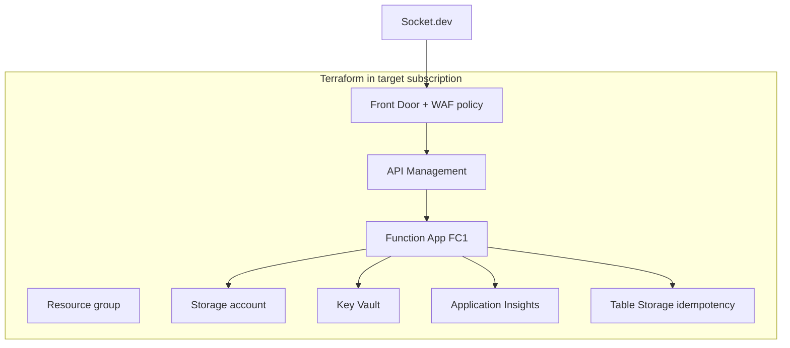

# Terraform: D6 Gateway Stack (Front Door → APIM → Function)

**Status:** Draft for implementation  
**Version:** 0.1  
**Date:** 2026-05-25  
**Related:** [DECISIONS.md § D6](./DECISIONS.md#d6--public-edge-gateway) · [WEBHOOK-INTEGRATION-STANDARD.md](./WEBHOOK-INTEGRATION-STANDARD.md) · [CONFIGURATION.md § 5.1](./CONFIGURATION.md#51-terraform-d6-gateway-stack)

This guide describes how to provision the **D6 public edge** and co-located Azure resources in the **same subscription** as the Function App, using Terraform.

Starter files live in [`../infra/terraform/`](../infra/terraform/).

---

## What Terraform deploys

Per [WEBHOOK-INTEGRATION-STANDARD.md](./WEBHOOK-INTEGRATION-STANDARD.md):



| Resource | Terraform module/file | Notes |
|----------|----------------------|-------|
| Resource group | `main.tf` | e.g. `rg-socket-alert-prod` (D7) |
| Front Door profile + endpoint + route | `modules/gateway/` | **Public hostname for Socket.dev** |
| WAF policy | `modules/gateway/` | Attached to Front Door route |
| API Management | `modules/apim/` | Backend → Function |
| Function App (FC1) | `modules/function/` | D8: Flex Consumption |
| Storage account | `modules/function/` | FC1 runtime requirement |
| Key Vault | `modules/function/` | RBAC; webhook secret |
| Application Insights | `modules/function/` | Observability |
| Table Storage | `modules/function/` | Idempotency store |

**Not in Terraform (manual / separate process):** Entra MI Graph permissions, Exchange Application Access Policy, Socket.dev webhook registration.

---

## Prerequisites

| Item | Source |
|------|--------|
| Azure subscription ID | Platform team — same subscription as Function and gateway |
| Azure region | e.g. `eastus` (APIM + Function co-located; Front Door is global) |
| Terraform ≥ 1.5 | CI/CD agent or operator workstation |
| Azure CLI + `az login` | Operator or pipeline service principal |
| Remote state storage | Storage account + container for `terraform.tfstate` |
| Custom domain (optional) | DNS zone for D6 hostname e.g. `webhooks.c3.ai` |
| Naming convention | Align with C3 AI standards |

### Service principal / pipeline identity

Terraform in CI/CD should use a service principal or managed identity with:

- `Contributor` on the target resource group (or subscription scoped per policy)
- `User Access Administrator` if Terraform assigns RBAC (Key Vault Secrets User for Function MI)
- Access to remote state storage account

Use `ARM_CLIENT_ID`, `ARM_CLIENT_SECRET`, `ARM_TENANT_ID`, `ARM_SUBSCRIPTION_ID` in pipeline — never commit secrets.

---

## Repository layout

```
infra/terraform/
├── README.md                 # Quick start commands
├── versions.tf               # Provider pins
├── providers.tf              # azurerm backend
├── variables.tf              # Inputs (subscription, names, D6 hostname)
├── outputs.tf                # socket_webhook_url, function_name, etc.
├── main.tf                   # Module wiring
├── terraform.tfvars.example
└── modules/
    ├── gateway/              # Front Door + WAF
    ├── apim/                 # APIM API → Function backend
    └── function/             # FC1, storage, KV, App Insights, table
```

Update [SPEC.md § 11](./SPEC.md#11-proposed-repository-layout-implementation-phase) references Bicep → Terraform for infra.

---

## Step-by-step: put together the Terraform

### Step 1 — Bootstrap remote state

One-time per subscription (or use existing platform state storage):

```bash
export SUBSCRIPTION_ID="<target-subscription-id>"
export LOCATION="eastus"
export STATE_RG="rg-terraform-state"
export STATE_SA="stterraformstate<C3_SUFFIX>"   # globally unique
export STATE_CONTAINER="tfstate"

az account set --subscription "$SUBSCRIPTION_ID"
az group create --name "$STATE_RG" --location "$LOCATION"
az storage account create \
  --name "$STATE_SA" \
  --resource-group "$STATE_RG" \
  --location "$LOCATION" \
  --sku Standard_LRS \
  --encryption-services blob
az storage container create \
  --name "$STATE_CONTAINER" \
  --account-name "$STATE_SA"
```

Uncomment and set the `backend "azurerm"` block in `providers.tf` with these values.

### Step 2 — Copy and fill variables

```bash
cd infra/terraform
cp terraform.tfvars.example terraform.tfvars
# Edit terraform.tfvars — do not commit terraform.tfvars if it contains secrets
```

Key variables (from [DECISIONS.md](./DECISIONS.md)):

| Variable | Example | Decision |
|----------|---------|----------|
| `subscription_id` | GUID | Target subscription |
| `location` | `eastus` | Region |
| `environment` | `prod` | D7 |
| `project_name` | `socket-alert` | Naming prefix |
| `custom_domain` | `webhooks.c3.ai` | D6 — optional |
| `webhook_path` | `/webhooks/socket` | D6 |
| `mail_sender_upn` | `socket-alerts@c3.ai` | D4 |
| `mail_to_addresses` | `dependency-security@c3.ai` | D9 |

### Step 3 — Plan and apply

```bash
terraform init
terraform plan -out=tfplan
terraform apply tfplan
```

Review plan for:

- Front Door route: `POST` only on webhook path
- WAF policy in **Prevention** mode (after validation in Detection)
- Function **access restrictions** — allow Front Door / APIM only
- Key Vault **RBAC** — Function MI → Secrets User
- No public network access on Key Vault (AzureServices bypass as needed)

### Step 4 — Capture outputs

After apply:

```bash
terraform output socket_webhook_url
terraform output function_app_name
terraform output key_vault_name
```

Register `socket_webhook_url` in Socket.dev dashboard. Store signing secret in Key Vault (`socket-webhook-secret`).

### Step 5 — Post-Terraform configuration

| Task | Doc |
|------|-----|
| Grant Function MI `Mail.Send` + admin consent | [CONFIGURATION.md § 2](./CONFIGURATION.md#2-microsoft-entra-id) |
| Exchange Application Access Policy | [CONFIGURATION.md § 4](./CONFIGURATION.md#4-microsoft-365--exchange-online) |
| Deploy Function code | `src/` (future) |
| Register Socket webhook | [CONFIGURATION.md § 1](./CONFIGURATION.md#1-socketdev-c3-ai-org-tenant) |

---

## Module design notes

### `modules/gateway` — Front Door + WAF

Responsibilities:

1. **Front Door profile** (Standard or Premium; Premium if private Link to APIM origin required)
2. **Endpoint** — default `{project}-{env}-fd.azurefd.net` or custom domain (D6)
3. **Origin group** — single origin: APIM gateway host (`{apim-name}.azure-api.net`)
4. **Route** — match path `/webhooks/socket` (or variable); HTTPS only; forward `POST`
5. **WAF policy** — OWASP 3.2 managed rules; start in **Detection**, switch to **Prevention** after testing
6. **Optional custom domain** — TLS cert from Key Vault or Front Door managed cert; DNS CNAME at registrar

References:

- [azurerm_cdn_frontdoor_profile](https://registry.terraform.io/providers/hashicorp/azurerm/latest/docs/resources/cdn_frontdoor_profile)
- [azurerm_cdn_frontdoor_firewall_policy](https://registry.terraform.io/providers/hashicorp/azurerm/latest/docs/resources/cdn_frontdoor_firewall_policy)

### `modules/apim` — API Management

Responsibilities:

1. **APIM instance** — Developer or Standard tier minimum for production SLAs
2. **API** — path e.g. `webhooks`; maps to Front Door forwarded path
3. **Backend** — Function App HTTPS URL (default host key in APIM Named Value / Key Vault reference)
4. **Policy** — forward request body unchanged (required for HMAC on raw JSON); pass through `x-webhook-signature`
5. **Rate limit policy** — e.g. 100 req/min per IP (tune for Socket retry behavior)

**Critical:** APIM must not rewrite the request body before it reaches the Function — HMAC verification uses the raw payload.

References:

- [azurerm_api_management](https://registry.terraform.io/providers/hashicorp/azurerm/latest/docs/resources/api_management)
- [azurerm_api_management_api](https://registry.terraform.io/providers/hashicorp/azurerm/latest/docs/resources/api_management_api)

### `modules/function` — FC1 + supporting services

Responsibilities:

1. **Storage account** — Functions runtime
2. **Application Insights** + Log Analytics workspace
3. **Key Vault** — RBAC authorization; soft delete enabled
4. **Function App (Flex Consumption)** — Node.js 20; system-assigned MI
5. **Table Storage table** — idempotency (`SocketWebhookEvents`)
6. **App settings** — Key Vault references; see [CONFIGURATION.md § 5](./CONFIGURATION.md#5-azure-platform-function-app--supporting-resources)
7. **Access restrictions** — allow `AzureFrontDoor.Backend` service tag and/or APIM outbound IPs; deny public by default

References:

- [azurerm_function_app_flex_consumption](https://registry.terraform.io/providers/hashicorp/azurerm/latest/docs/resources/function_app_flex_consumption)
- [Azure Functions Flex Consumption samples](https://github.com/Azure-Samples/functions-quickstart-javascript-azd/tree/main/infra)

---

## Function access restrictions (required)

The Function must **not** accept arbitrary internet traffic. After gateway deploy:

```hcl
# Example pattern in modules/function/main.tf
ip_restriction {
  name        = "AllowAzureFrontDoor"
  service_tag = "AzureFrontDoor.Backend"
  priority    = 100
  action      = "Allow"
}

ip_restriction {
  name       = "DenyAll"
  ip_address = "0.0.0.0/0"
  priority   = 200
  action     = "Deny"
}
```

Validate: direct `curl` to `*.azurewebsites.net` should **fail**; POST via Front Door URL should succeed.

---

## Socket.dev webhook URL (D6 output)

Terraform output should compose:

```
https://<custom_domain_or_fd_endpoint><webhook_path>
```

Example: `https://webhooks.c3.ai/webhooks/socket`

The Function key may be:

- **Option 1:** Appended by APIM as `?code=` via rewrite policy (key stored in Key Vault Named Value)
- **Option 2:** Validated only via HMAC at Function with auth level `anonymous` (gateway + HMAC only)

Recommended: keep Function auth level `function` and have APIM inject the key when forwarding, so the key is not in the Socket dashboard URL.

---

## CI/CD integration

| Stage | Action |
|-------|--------|
| `terraform plan` | On PR — review infrastructure diff |
| `terraform apply` | On merge to main — prod subscription only (D7) |
| Function deploy | Separate step after infra — `func azure functionapp publish` or ZIP deploy |
| Smoke test | POST test payload through Front Door URL |

Store `terraform.tfvars` secrets in pipeline variable group or Azure Key Vault — not in git.

---

## Compliance with C3 AI policy

Before first apply in a subscription:

```bash
# If policy assignments exist, review before apply
az policy assignment list --subscription "$SUBSCRIPTION_ID" -o table
```

Align SKUs, regions, tagging, and diagnostic settings with subscription policy. Add required tags in `variables.tf` / module locals.

---

## Document history

| Version | Date | Changes |
|---------|------|---------|
| 0.1 | 2026-05-25 | Initial Terraform guide for D6 gateway stack |
