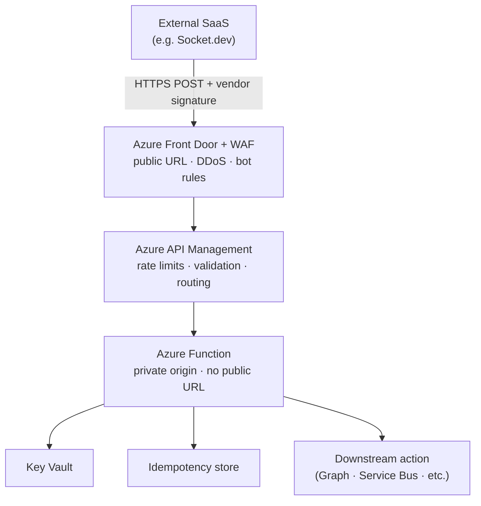

# C3 AI Standard: Inbound SaaS Webhook Integration

**Status:** Adopted for this project  
**Version:** 1.0  
**Date:** 2026-05-25  
**Applies to:** Socket.dev and any future SaaS → Azure webhook integrations

This is the **single standard pattern** for receiving webhooks from external SaaS vendors. Socket.dev is one instance of this pattern—not a special case.

---

## Why this exists

Webhook integrations are simple in concept (vendor POSTs JSON → you act on it). They become confusing when documentation mixes:

- **Architecture** (what must exist) with **product choices** (APIM vs Front Door)
- **User SSO** (humans logging into SaaS) with **webhooks** (servers calling servers)
- **Compliance** checkboxes with **security posture**

This document removes that noise. Follow this pattern for every inbound SaaS webhook.

---

## The pattern (one diagram)

**Rule:** The vendor dashboard registers **one URL** — the Front Door (or org-standard gateway) hostname. The Function App hostname (`*.azurewebsites.net`) is **never** registered with any vendor.

---

## How it works (5 steps)

| Step | What happens |
|------|--------------|
| 1 | SaaS sends `POST` with JSON body and signature header |
| 2 | Front Door applies WAF, DDoS protection, TLS termination |
| 3 | APIM applies rate limits, routing, optional IP restrictions |
| 4 | Function verifies signature, checks idempotency, processes payload |
| 5 | Function performs action (send email, create ticket, enqueue event) |

---

## Security controls (all required)

These are **non-negotiable** for every SaaS webhook integration at C3 AI:

| # | Control | Implementation |
|---|---------|----------------|
| 1 | **No direct compute exposure** | Function accepts traffic only from gateway; not on public internet |
| 2 | **Vendor signature verification** | HMAC-SHA256 on raw body (Standard Webhooks / vendor spec) before any processing |
| 3 | **Replay protection** | Reject signatures older than 5 minutes |
| 4 | **Idempotency** | Store processed event IDs; return 200 on duplicates without re-acting |
| 5 | **Secrets in Key Vault** | Signing secrets and credentials never in source control |
| 6 | **Managed Identity** | Function uses MI for Azure and Graph access—no long-lived secrets where avoidable |
| 7 | **Least privilege downstream** | e.g. Graph `Mail.Send` scoped via Exchange Application Access Policy |
| 8 | **Input treated as hostile** | HTML-encode email content; no dynamic code execution from payload |
| 9 | **Observability** | Log event IDs and outcomes; alert on signature failures and processing errors |
| 10 | **TLS 1.2+ only** | HTTPS end-to-end |

---

## What is public vs private

| Component | Public? |
|-----------|---------|
| Front Door hostname | **Yes** — this is the vendor webhook URL |
| API Management | Internal to Azure network path; not registered with vendor if Front Door is front |
| Function App | **No** |
| Key Vault | **No** |
| Storage / idempotency | **No** |
| Microsoft Graph / O365 | **No** (outbound only) |

---

## What the vendor configures

For Socket.dev (same shape for any webhook SaaS):

| Vendor setting | Value |
|----------------|-------|
| Webhook URL | `https://<front-door-hostname>/webhooks/socket` (example path) |
| Signing secret | Generated by vendor; stored in Key Vault |
| Event types | Scoped to what you need (alerts only for this project) |

**Not used for webhooks:** Entra SSO app registration, OAuth, or employee credentials.

---

## What is NOT part of this pattern

| Topic | Why it is separate |
|-------|-------------------|
| **SSO to SaaS dashboard** | Human login (Entra → Socket UI). Different auth, different flow. |
| **Polling vendor APIs** | You call them; no inbound URL needed. |
| **Compliance frameworks** | This pattern supports security posture; it is not driven by a checkbox. |

---

## Socket.dev instance (this repo)

This project applies the standard pattern as follows:

| Standard layer | This project |
|----------------|--------------|
| SaaS | Socket.dev (C3 AI org tenant) |
| Public URL | Front Door + APIM (see [DECISIONS.md § D6](./DECISIONS.md#d6--public-edge-gateway)) |
| Receiver | Azure Function (Node.js TypeScript) |
| Verification | Socket `x-webhook-signature` (Standard Webhooks HMAC) |
| Action | Microsoft Graph `sendMail` → O365 inbox |
| Sender | `socket-alerts@c3.ai` |
| Events | `alert:created`, `alert:updated`, `alert:cleared` only |

---

## Implementation checklist

Use this for Socket.dev and copy for the next vendor webhook:

- [ ] Front Door + WAF endpoint provisioned
- [ ] APIM API/route configured to forward to Function
- [ ] Function inbound restricted to gateway origin only
- [ ] Vendor signing secret in Key Vault
- [ ] Signature verification implemented and unit-tested
- [ ] Idempotency store deployed
- [ ] Managed Identity granted least-privilege downstream permissions
- [ ] Vendor webhook URL points to Front Door hostname only
- [ ] Application Insights alerts configured
- [ ] End-to-end test with vendor test payload

---

## Document history

| Version | Date | Changes |
|---------|------|---------|
| 1.0 | 2026-05-25 | Initial C3 AI standard inbound SaaS webhook pattern |
